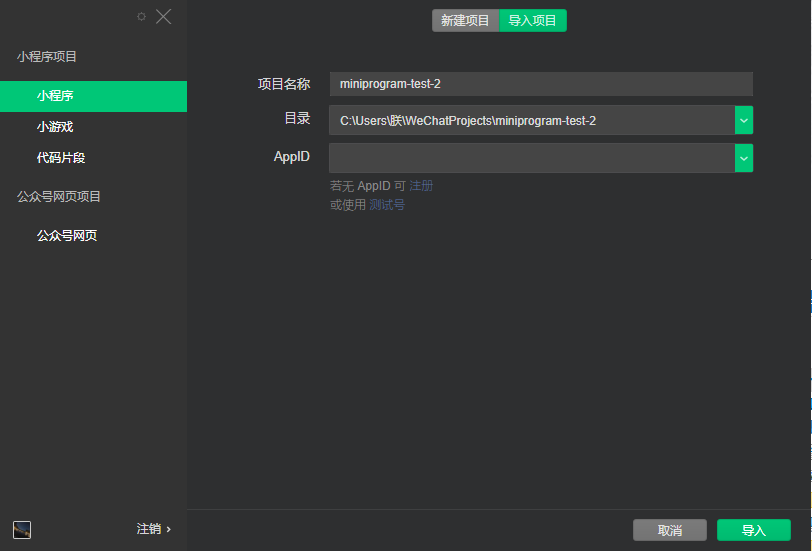

# 微信小程序案例
### 如何使用
##### 安装开发者工具
- 前往[开发者工具下载页面](https://developers.weixin.qq.com/miniprogram/dev/devtools/download.html?t=19050714)
- 打开微信开发者工具
> 
- 微信开发者工具，进行项目的导入
> 
- 添加自己的第一个项目
> 
##### 小程序的代码构成
- 1、.json后缀的JSON配置文件
- 2、.wxml后缀的WXML模板文件
- 3、.wxss后缀的WXSS样式文件
- 4、.js后缀的JS脚本文件
##### 小程序简述
- 该小程序是对某学校的参观进行预约，对时间的预约，以及参观时间的设定。可以简单的了解我们在对一些预约的正确处理。

[小程序组件参考文档](https://developers.weixin.qq.com/miniprogram/dev/api/)